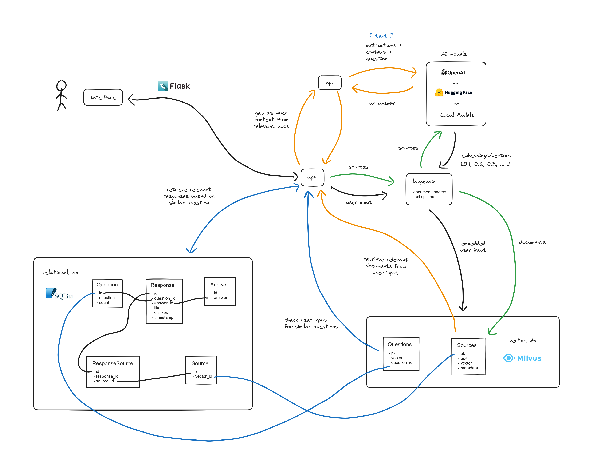

# OpenAI-Milvus-QA-Over-Docs

Uses [Milvus](https://milvus.io/) as a document store and [OpenAI's](https://platform.openai.com/docs/models/gpt-3-5) chat API for a simple app that allows the user ask question based on given sources.

- Supports CSV, PDF files
- Supports web pages
- Provides the maximum possible context to the AI model
- No chat memory/history

## How it works

1. A Milvus instance is run
2. Files and websites are ingested through [Langchain's](https://github.com/hwchase17/langchain) document loaders and text splitter
3. Documents embedded by OpenAI embeddings and added to Milvus collection through `langchain`
4. Only data ingestion done through Langchain, rest uses `pymilvus` and `openai`
5. A user inputs a query into the chat interface, and gets embedded by OpenAI embeddings (okay embeddings still done through `langchain`)
6. Similarity search is done with the embedded query and the top 20 most similar documents are returned
7. From the top 20, as much context/text is retrieved until the token limit is reached. 4096 for OpenAI gpt-3.5 (maximum set to 4000)
8. Instructions for the model, the context, and the original question is given to the OpenAI chat model
9. Response is returned and displayed in a chat interface

## How to run

[Install and run a Milvus instance](https://milvus.io/docs/install_standalone-docker.md)

Make sure you have the necessary requirements to run the Python program

`pip install -r requirements.txt`

Create a `.env` file in the directory and put the OpenAI API key in as follows:

`OPENAI_API_KEY=...`

Then run the app with

`flask run` or `python3 app.py`

A Flask app will run locally. Click on the url provided in the terminal to open the app. For example:

`http://127.0.0.1:5000`